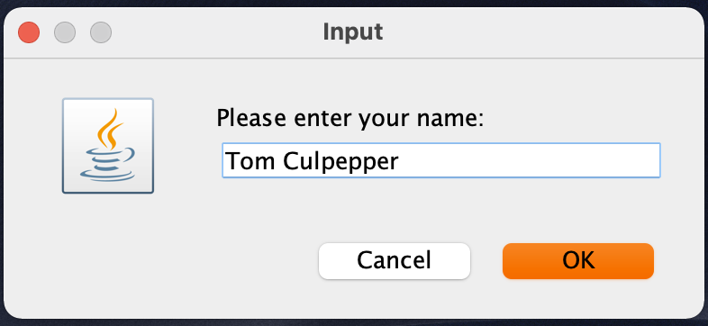
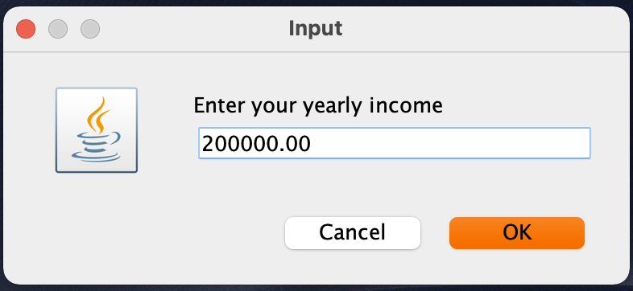
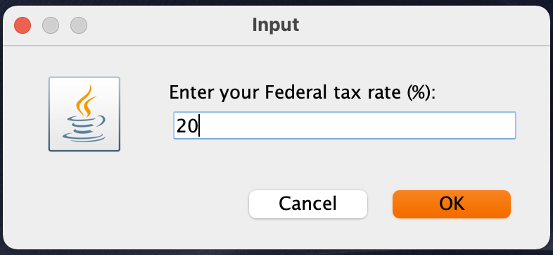
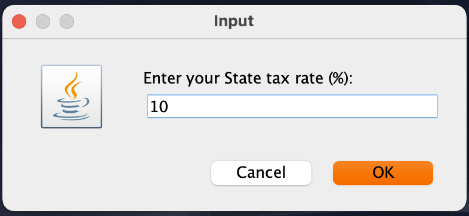
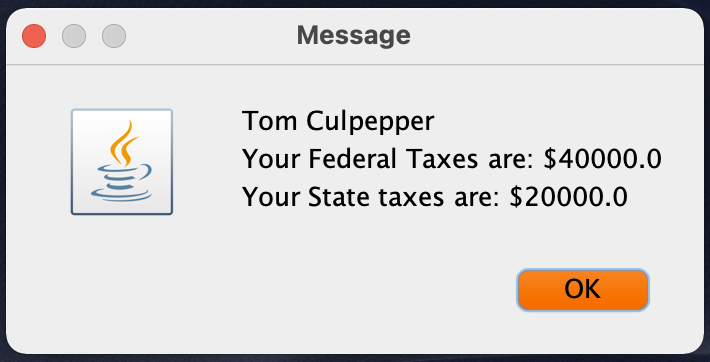
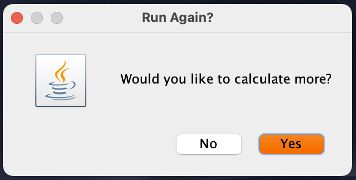

~~~~~{#mycode .java .numberLines startFrom="100"}
 /**
* The CalcTaxes program implements an application that requests tax information 
* from the user and then calculates taxes due.
*
* Assignment: CSC310 Mod 1 Case
*
* @author  Thomas Culpepper
* @version 1.0
* @since   2021-12-28
*/
import javax.swing.JOptionPane;
import java.util.regex.*;

public class CalcTaxes {
    public static void main(String[] args) {
        boolean calcAgain = true; //control to run again or exit

        JOptionPane.showMessageDialog(
            null, "This program will calculate your federal and state taxes");

        while (calcAgain) {
            String validationPattern = null;
            String errorMessage = null;
            String [] userInputs = new String[4]; //array to hold user input strings
            String [][] inputRequests = { //input requests and expected type (num or str)
                {"Please enter your name:","str"},
                {"Enter your yearly income","num"},
                {"Enter your Federal tax rate (%):","num"},
                {"Enter your State tax rate (%):","num"}
            };
            for (int i=0; i < inputRequests.length; i++) {
                userInputs[i] = JOptionPane.showInputDialog(inputRequests[i][0]);
                if (userInputs[i] == null) { // Exit cleanly if user hits cancel
                    System.exit(0);
                }
                else if (inputRequests[i][1].equals("num")){
                    validationPattern = "^\\d+$|^-?\\d*\\.\\d{2}$"; // match integer or 2 place decimal
                    errorMessage = "Please enter a number \n(000 or 00.00)";
                }
                else if (inputRequests[i][1].equals("str")) {
                    validationPattern = "^[A-Za-z]+\\s*[A-Za-z]*$"; // match name and optional 2nd name
                    errorMessage = "Try again./nNo numbers or symbols please";
                }
                else {
                    JOptionPane.showMessageDialog(
                        null, "Illegal Input type Option. Please contact the developer.");
                    throw new IllegalArgumentException(
                        "Input type option invalid. Only 'num' or 'str' allowed");
                }

                Pattern p = Pattern.compile(validationPattern);
                Matcher m = p.matcher(userInputs[i]);
                if (!m.find()){ 
                    JOptionPane.showMessageDialog(null, errorMessage);
                    i--;
                }
            }

            double yearlyIncome = Double.parseDouble(userInputs[1]);
            double fedTaxRate = Double.parseDouble(userInputs[2]) / 100;
            double stateTaxRate = Double.parseDouble(userInputs[3]) / 100;
            double fedTaxDue = yearlyIncome * fedTaxRate;
            double stateTaxDue = yearlyIncome * stateTaxRate;

            JOptionPane.showMessageDialog(null, userInputs[0] + "\nYour Federal Taxes are: $" 
                + fedTaxDue + "\nYour State taxes are: $" + stateTaxDue);

            int reply = JOptionPane.showConfirmDialog(null, "Would you like to calculate more?", 
                "Run Again?",  JOptionPane.YES_NO_OPTION);
            if (reply == JOptionPane.NO_OPTION) {
                    calcAgain = false;
            }
        }
    } 
}
~~~~~

# User Screens

{#fig:screen1 height=1.5in}

{#fig:screen2 height=1.5in}

{#fig:screen3 height=1.5in}

{#fig:screen4 height=1.5in}

{#fig:screen5 height=1.5in}

{#fig:screen6 height=1.5in}