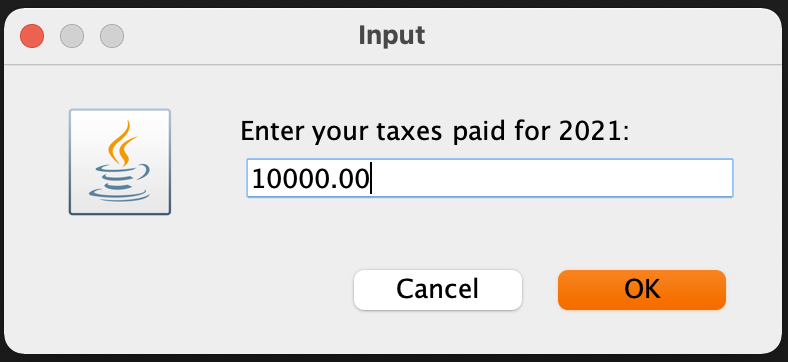
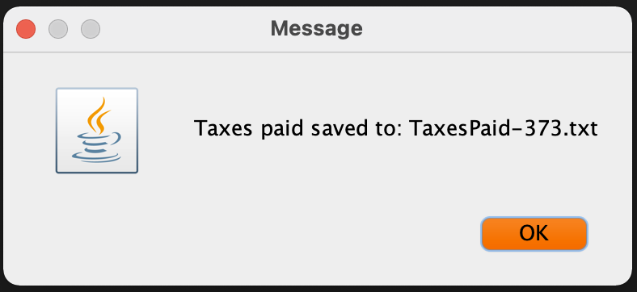
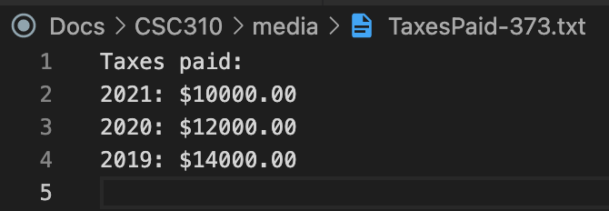

```java
/**
* The TaxesToFile program implements an application that requests taxes paid
* for a number of years from the user and then writes that data out to a file.
*
* Assignment: CSC310 Mod 1 SLP
*
* @author  Thomas Culpepper
* @version 1.0
* @since   2021-12-28
*/

import javax.swing.JOptionPane;
import java.util.Calendar;
import java.util.regex.*;
import java.io.*;
public class TaxesToFile {
    public static void main(String[] args) {
        Calendar cal = Calendar.getInstance();
        int year = cal.get(Calendar.YEAR);
        String userInput; //temporary holding for user input
        int yearsToCollect = 3; // number fo years of data to collect
        String[] taxesPaidArray = new String[3]; // array to hold user inputs

        // request taxes paid from the user starting with current year and going backwards as 
        //required by yearsToCollect
        for (int i = 0; i < yearsToCollect; i++) {
            int currentYear = (year - i);
            userInput = JOptionPane.showInputDialog("Enter your taxes paid for " + currentYear + ":");
            if (userInput == null) { // Exit cleanly if user hits cancel
                System.exit(0);
            }
            // validate the user input. If Invalid, notify and repeat iteration
            Pattern p = Pattern.compile("^-?\\d*\\.\\d{2}$"); //only allow 2 place decimal
            Matcher m = p.matcher(userInput);
            if (!m.find() || userInput.isBlank()){ 
                JOptionPane.showMessageDialog(null, "Please enter a decimal number \n(00.00)");
                i--;
                continue;
            }
            taxesPaidArray[i] = (String.valueOf(currentYear) + ": $" + userInput);
        }

        String millisec = String.valueOf(cal.get(Calendar.MILLISECOND)); // to make unique filename
        String outfile = ("TaxesPaid-" + millisec + ".txt");
        
        // Open the writer with a transparent buffer to read the array into
        try(Writer writer = new BufferedWriter(new FileWriter(outfile));){
            writer.write("Taxes paid:");
            writer.write(System.lineSeparator());

            for (String i : taxesPaidArray) {
                writer.write(i);
                writer.write(System.lineSeparator());
              }

            writer.flush();
        }
        catch (IOException e) {
            e.printStackTrace();
        }

        JOptionPane.showMessageDialog(null, "Taxes paid saved to: " + outfile);
    }
}
```

## User Screens

{#fig:screen1 height=1.5in}

{#fig:screen2 height=1.5in}

{#fig:screen3 height=1.5in}

{#fig:screen4 height=1.5in}


## Output Text File

{#fig:outfile height=1.5in}